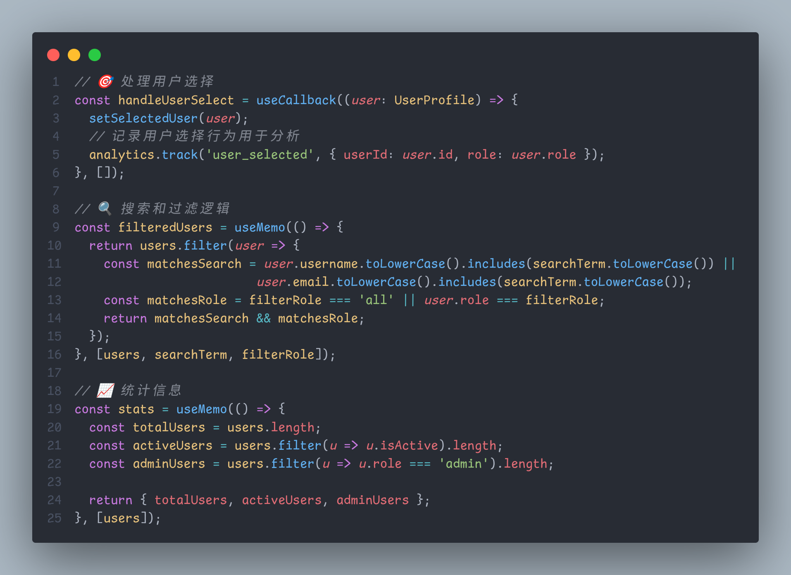

# ChHsich Nerd Font 创建工具

这个工具用于将 ComicShannsMono Nerd Font 的特定字符替换到 Maple Mono NF CN 中，创建 ChHsich Nerd Font。

## 项目状态

✅ **项目已完成**
- 成功创建了16个ChHsich Nerd Font字体文件
- 所有字体都包含了所需的109个字符
- 字体名称已正确更新为"ChHsich Nerd Font"
- 字符替换成功完成
- 提供完整的安装和卸载脚本
- ✅ **新增：TTC字体集合文件** - 将所有字体样式打包到一个文件中，方便Windows用户安装
- ✅ **新增：分卷压缩文件** - 提供分卷压缩版本，便于下载和分发
- ✅ **新增：AUR包** - Arch Linux用户可通过 `yay -S chhsich-nerd-font` 或 `paru -S chhsich-nerd-font` 直接安装

## 功能

- 将 ComicShannsMono Nerd Font 的以下字符替换到 Maple Mono NF CN 中：
  - U+0021 到 U+007E (基本拉丁字母、数字和符号)
  - U+00A1 到 U+00A6 (拉丁-1补充符号)
  - U+00AB (左双角引号)
  - U+00AC (逻辑非符号)
  - U+00AF (上划线)
  - U+00B0 (度数符号)
  - U+00B1 (正负号)
  - U+00B4 (重音符)
  - U+00BB (右双角引号)
  - U+00D7 (乘号)
  - U+00F7 (除号)

## 字体样例

以下是ChHsichNerdFont字体的实际使用效果截图：

### 代码编辑器示例


*ChHsichNerdFont字体在代码编辑器中的显示效果*

### 终端示例



*ChHsichNerdFont字体在终端中的显示效果*

### 字体特性

ChHsichNerdFont字体特别适合编程使用，具有以下优势：

- **优秀的中文字符显示** - 基于Maple Mono NF CN，中文字符清晰美观
- **清晰的英文字符** - 基于ComicShannsMono，英文字符易于识别
- **完整的Nerd图标支持** - 支持所有Nerd Font图标
- **多权重支持** - 提供Thin到ExtraBold共9种字重
- **斜体支持** - 每种字重都有对应的斜体版本

## 系统要求

- Arch Linux (或其他支持 FontForge 的 Linux 发行版)
- Python 3
- FontForge
- fontTools (用于创建TTC文件)

## 安装依赖

```bash
# 安装 FontForge
sudo pacman -S fontforge

# 安装 fontTools (用于创建TTC文件)
sudo pacman -S python-fonttools
```

## 使用方法

### 1. 创建字体

1. 确保项目目录结构如下：
   ```
   ChHsich-Nerd-Font/
   ├── ComicShannsMono/           # ComicShannsMono Nerd Font 文件
   ├── MapleMono-NF-CN-unhinted/  # Maple Mono NF CN 字体文件
   ├── ChHsichNerdFont/           # 输出目录 (生成的字体文件)
   ├── ttc_release/               # TTC分卷压缩文件目录
   ├── create_chhsich_nerd_font.py
   ├── create_ttc_font.py         # TTC文件创建脚本
   ├── test_fontforge.py
   ├── verify_font.py
   ├── install.sh                  # 安装脚本
   ├── uninstall.sh                # 卸载脚本
   ├── LICENSE                     # 许可证文件
   └── README.md
   ```

2. 测试 FontForge 安装：
   ```bash
   python3 test_fontforge.py
   ```

3. 运行字体创建脚本：
   ```bash
   python3 create_chhsich_nerd_font.py
   ```

4. 验证生成的字体：
   ```bash
   python3 verify_font.py
   ```

### 2. 创建TTC字体集合文件（可选）

为了方便Windows用户安装，你可以创建一个包含所有字体样式的TTC文件：

```bash
# 创建TTC文件
python3 create_ttc_font.py
```

这将生成 `ChHsichNerdFont.ttc` 文件，包含所有16个字体样式。Windows用户只需双击这个文件即可一次性安装所有字体样式。

**TTC文件优势：**
- 一次性安装所有字体样式
- 节省安装时间
- 更好的字体管理
- Windows原生支持

### 3. 创建分卷压缩文件（可选）

为了方便下载和分发，你可以创建分卷压缩文件：

```bash
# 创建分卷压缩文件
mkdir -p ttc_release
cd ttc_release
split -b 95M ../ChHsichNerdFont.ttc ChHsichNerdFont.part
zip -9 ChHsichNerdFont.zip.001 ChHsichNerdFont.partaa
zip -9 ChHsichNerdFont.zip.002 ChHsichNerdFont.partab
zip -9 ChHsichNerdFont.zip.003 ChHsichNerdFont.partac
rm ChHsichNerdFont.part*
```

这将生成三个分卷文件：
- `ChHsichNerdFont.zip.001` (50MB)
- `ChHsichNerdFont.zip.002` (50MB)
- `ChHsichNerdFont.zip.003` (49MB)

详细说明请查看 [TTC_INSTALLATION.md](TTC_INSTALLATION.md)。

### 3. 安装字体到系统

#### AUR安装（Arch Linux用户推荐）

如果你使用的是Arch Linux或基于Arch的发行版，可以直接通过AUR安装：

```bash
# 使用yay安装
yay -S chhsich-nerd-font

# 或使用paru安装
paru -S chhsich-nerd-font
```

这是最简单的安装方式，AUR包会自动处理字体安装和缓存更新。

#### 自动安装（推荐）

```bash
# 运行安装脚本
./install.sh
```

安装脚本会：
- 自动检测系统类型（Linux/macOS）
- 选择合适的字体安装目录
- 复制字体文件到系统字体目录
- 更新字体缓存
- 创建卸载脚本

#### 手动安装

```bash
# Linux系统
sudo cp -r ChHsichNerdFont/* /usr/share/fonts/ChHsichNerdFont/
sudo fc-cache -f -v

# 或者安装到用户目录
mkdir -p ~/.local/share/fonts/ChHsichNerdFont
cp -r ChHsichNerdFont/* ~/.local/share/fonts/ChHsichNerdFont/
fc-cache -f -v
```

### 4. 卸载字体

#### 自动卸载（推荐）

```bash
# 运行卸载脚本
./uninstall.sh
```

卸载脚本会：
- 自动检测字体安装位置
- 完全移除字体文件
- 更新字体缓存
- 清理残留文件

#### 手动卸载

```bash
# 如果安装在系统目录
sudo rm -rf /usr/share/fonts/ChHsichNerdFont
sudo fc-cache -f -v

# 如果安装在用户目录
rm -rf ~/.local/share/fonts/ChHsichNerdFont
fc-cache -f -v
```

## 输出

脚本将在 `ChHsichNerdFont/` 目录中生成以下字体文件：
- ChHsichNerdFont-Regular.ttf
- ChHsichNerdFont-Bold.ttf
- ChHsichNerdFont-Italic.ttf
- ChHsichNerdFont-BoldItalic.ttf
- ChHsichNerdFont-Light.ttf
- ChHsichNerdFont-LightItalic.ttf
- ChHsichNerdFont-Medium.ttf
- ChHsichNerdFont-MediumItalic.ttf
- ChHsichNerdFont-SemiBold.ttf
- ChHsichNerdFont-SemiBoldItalic.ttf
- ChHsichNerdFont-ExtraBold.ttf
- ChHsichNerdFont-ExtraBoldItalic.ttf
- ChHsichNerdFont-Thin.ttf
- ChHsichNerdFont-ThinItalic.ttf
- ChHsichNerdFont-ExtraLight.ttf
- ChHsichNerdFont-ExtraLightItalic.ttf

**TTC文件（可选）：**
- ChHsichNerdFont.ttc - 包含所有16个字体样式的集合文件（约284MB）

## 验证结果

✅ **成功创建了16个字体文件**
- 所有字体文件都包含了所需的109个字符
- 字体名称已正确更新为 "ChHsich Nerd Font"
- 字符替换成功：ComicShannsMono Nerd Font 的英文字符已替换到 Maple Mono NF CN 中
- ✅ **TTC文件创建成功** - 包含所有16个字体样式，方便Windows用户安装

## 许可证

本项目基于以下开源字体创建：

1. **ComicShannsMono Nerd Font**
   - Copyright (c) 2018 Shannon Miwa
   - Copyright (c) 2023 Jesus Gonzalez
   - Licensed under MIT License

2. **Maple Mono NF CN**
   - Copyright 2022 The Maple Mono Project Authors
   - Licensed under SIL Open Font License, Version 1.1

**ChHsich Nerd Font** 采用 SIL Open Font License, Version 1.1 许可证。

### 许可证要求：
- ✅ 可以自由使用、修改和分发
- ❌ **不能单独销售字体文件**
- ✅ 可以与其他软件捆绑分发
- ✅ 必须包含原始版权声明和许可证
- ✅ 必须使用相同的许可证

详细许可证信息请查看 [LICENSE](LICENSE) 文件。

## 注意事项

- 脚本会自动匹配字体样式（Regular、Bold、Italic等）
- 如果源字体中缺少某些字符，脚本会显示警告信息
- 生成的字体将保留 Maple Mono NF CN 的中文字符和 ComicShannsMono Nerd Font 的英文字符
- 字体名称会自动更新为 "ChHsich Nerd Font"
- **请遵守许可证要求，不要单独销售字体文件**
- 安装脚本会自动检测系统类型并选择合适的安装目录
- 卸载脚本会完全清理字体文件，不会留下残留

## 故障排除

如果遇到问题，请检查：
1. FontForge 是否正确安装
2. 字体文件是否存在于正确的目录中
3. 是否有足够的磁盘空间
4. 是否有写入权限
5. 安装脚本是否有执行权限（`chmod +x install.sh`）
6. 系统是否支持字体缓存更新（`fc-cache`命令）

## 贡献

欢迎提交Issue和Pull Request来改进这个项目。请确保遵守原始字体的许可证要求。 